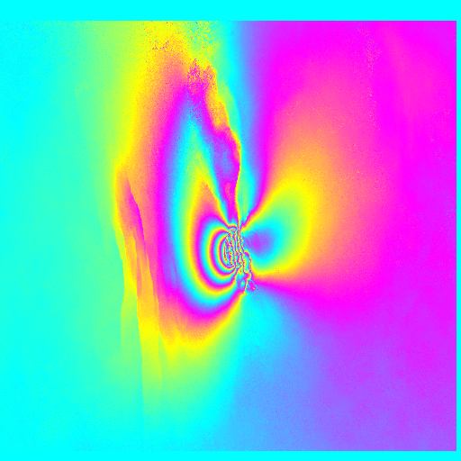
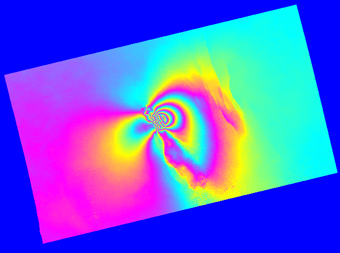

# NISARAPP
Time-series analysis extension for NISAR LSAR Data

NISARAPP is a Python-based time-series analysis extension package for **NISAR LSAR data**.  
It integrates the standard DInSAR processing flow from **ISCE3** and selected functionalities from **ISCE2**, enabling end-to-end time-series processing, including coregistration, interferometry, error correction, phase unwrapping, SBAS estimation, and geocoding.

> **Note:**  
> - Only coregistration currently uses ISCE3.  
> - All subsequent processing and output formats follow the **ISCE2 ALOS2Stack** framework.  
> - No filtering module is included in this version due to the relatively high quality of current test data; filtering will be added in a future release.

---

## Features

- Coregistration (ISCE3)
- Interferogram generation
- Error correction
- Phase unwrapping
- SBAS time-series estimation (unweighted least squares)
- Geocoding
- Command-line workflow generation

---

## Requirements

### Software dependencies

- [ISCE2](https://github.com/isce-framework/isce2)
- [ISCE3](https://github.com/isce-framework/isce3)

It is recommended to install ISCE2 and ISCE3 in **two separate Conda environments**.

### Additional Python packages (in the ISCE2 environment)

- `matplotlib`
- `yaml`
- `json`
- `pyaps`
- `pysolid`

---

## Installation

Clone this repository into your working directory and make sure ISCE2 and ISCE3 are properly installed and activated in their respective environments before running NISARAPP.

---

## Input Data Preparation

Before running the package, prepare the following:

- NISAR LSAR SLC data
- A DEM file (`dem.tif`)

---

## Usage

### 1. Configure parameters

Copy the `configs/` folder from the NISARAPP package to your processing directory.  
Edit the following files as needed:

- `config.yaml`: main parameters for NISARAPP processing
- `insar.yaml`: configuration file required by ISCE3

### 2. Generate processing commands

Run the following command to generate shell scripts:
```bash
path_of_PythonToISCE3 path_of_NISARAPP.py \

-config path_to_config.yaml \

-insar path_to_insar.yaml

```

This will create a `cmds/` folder under the output directory defined in `config.yaml`, containing a series of shell scripts (`cmd1_Preprocessing.sh`, `cmd2_Interferometry.sh`, …).

### 3. Execute processing steps

Run the generated shell scripts sequentially:
```bash
cd path/to/cmds
./cmd1_Preprocessing.sh
./cmd2_Interferometry.sh
......

```

> **Important:**  
> For ionospheric correction, inspect the preliminary correction results before proceeding to subsequent steps. The workflow follows the ALOS2Stack procedure.

### 4. SBAS time-series processing

After running `cmdx_SBAS.sh`, a `./ts` folder will be created in the output directory.  
It contains:

- A list of interferometric pairs used in SBAS
- A shell script for time-series estimation

Run the script inside `./ts` to perform SBAS processing.  
The final outputs include:

- Time-series displacement
- Linear velocity

> **Note:**  
> The current SBAS implementation uses **unweighted least squares**.  
> Coherence-weighted least squares will be supported in a future version.

### 5. Geocoding

To geocode the time-series results (e.g., velocity map), use `Geocode.py`.
**View required parameters:**
```bash
path_to_PythonToISCE2 path_to_Geocode.py -h
```
**Example:**
```bash
/home/kunyichen/anaconda3/envs/isce2/bin/python \

/sar1/kunyichen/TS4NISAR/TS4NISAR-main/NISARAPP/Geocode.py \

-config /sar1/kunyichen/TS4NISAR/TS4NISAR-main/NISAR_Data_test2/configs/config.yaml \

-input /sar1/kunyichen/TS4NISAR/TS4NISAR-main/NISAR_Data_test2/ts/velocity.unw \

-fill_value 0

```
The output will be `velocity.unw.geo` in the same directory.

## Results
**Examples: Left: Time-series velocity in SAR coordinates. Right: Time-series velocity after geocoding.**

 


---

## Notes

- Default parameters are used in the standard processing flow and may not be optimal for all datasets.
- Each processing step can be customized by modifying the corresponding Python script inputs.
- Filtering and frame mosaicking functionalities are under development and will be included in a later release.

---

## License

This project is licensed under the MIT License.  
(see [LICENSE](LICENSE) for details)

---

## Contact

For questions or feedback, please contact:  
**<Kunyi Chen (陈坤一)/ cky2366531304@stu.pku.edu.cn>**
